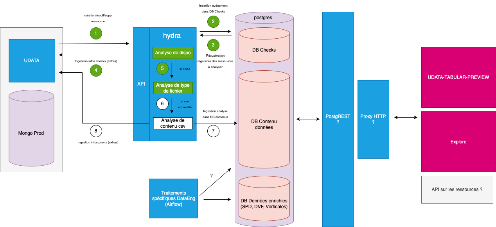
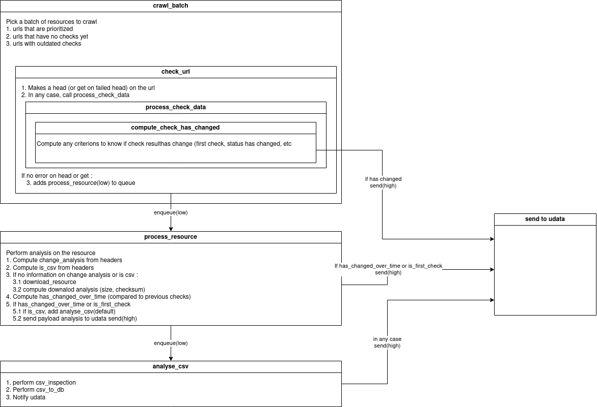

# udata-hydra

[](https://circleci.com/gh/datagouv/hydra)
[](https://opensource.org/licenses/MIT)

`udata-hydra` is an async metadata crawler for [data.gouv.fr](https://www.data.gouv.fr).

URLs are crawled via _aiohttp_, catalog and crawled metadata are stored in a _PostgreSQL_ database.

Since it's called _hydra_, it also has mythical powers embedded:
- analyse remote resource metadata over time to detect changes in the smartest way possible
- if the remote resource is tabular (csv or excel-like), convert it to a PostgreSQL table, ready for APIfication, and to parquet to offer another distribution of the data
- if the remote resource is a geojson, convert it to PMTiles to offer another distribution of the data
- send crawl and analysis info to a udata instance

## 🏗️ Architecture schema

The architecture for the full workflow is the following:




The hydra crawler is one of the components of the architecture. It will check if resource is available, analyse the type of file if the resource has been modified, and analyse the CSV content. It will also convert CSV resources to database tables and send the data to a udata instance.



## 📦 Dependencies

This project uses `libmagic`, which needs to be installed on your system, eg:

`brew install libmagic` on MacOS, or `sudo apt-get install libmagic-dev` on linux.

This project uses Python >=3.11 and [Poetry](https://python-poetry.org) >= 2.0.0 to manage dependencies.

## 🖥️ CLI

### Create database structure

Install udata-hydra dependencies and cli.
`poetry install`

`poetry run udata-hydra migrate`

### Load (UPSERT) latest catalog version from data.gouv.fr

`poetry run udata-hydra load-catalog`

## 🕷️ Crawler

`poetry run udata-hydra-crawl`

It will crawl (forever) the catalog according to the config set in `config.toml`, with a default config in `udata_hydra/config_default.toml`.

`BATCH_SIZE` URLs are queued at each loop run.

The crawler will start with URLs never checked and then proceed with URLs crawled before `CHECK_DELAYS` interval. It will then wait until something changes (catalog or time).

There's a by-domain backoff mechanism. The crawler will wait when, for a given domain in a given batch, `BACKOFF_NB_REQ` is exceeded in a period of `BACKOFF_PERIOD` seconds. It will retry until the backoff is lifted.

If an URL matches one of the `EXCLUDED_PATTERNS`, it will never be checked.

## ⚙️ Worker

A job queuing system is used to process long-running tasks. Launch the worker with the following command:

`poetry run rq worker -c udata_hydra.worker`

To monitor worker status:

`poetry run rq info -c udata_hydra.worker --interval 1`

To empty all the queues:

`poetry run rq empty -c udata_hydra.worker low default high`

## 📊 CSV conversion to database

Converted CSV tables will be stored in the database specified via `config.DATABASE_URL_CSV`. For tests it's the same database as for the catalog. Locally, `docker compose` will launch two distinct database containers.

## 🧪 Tests

To run the tests, you need to launch the database, the test database, and the Redis broker with `docker compose -f docker-compose.yml -f docker-compose.test.yml -f docker-compose.broker.yml up -d`.

Make sure the dev dependencies are installed with `poetry install --extras dev`.

Then you can run the tests with `poetry run pytest`.

To run a specific test file, you can pass the path to the file to pytest, like this: `poetry run pytest tests/test_file.py`.

To run a specific test function, you can pass the path to the file and the name of the function to pytest, like this: `poetry run pytest tests/test_api/test_api_checks.py::test_get_latest_check`.

If you would like to see print statements as they are executed, you can pass the -s flag to pytest (`poetry run pytest -s`). However, note that this can sometimes be difficult to parse.

### 📈 Tests coverage

Pytest automatically uses the `coverage` package to generate a coverage report, which is displayed at the end of the test run in the terminal.
The coverage is configured in the `pyproject.toml` file, in the `[tool.pytest.ini_options]` section.
You can also override the coverage report configuration when running the tests by passing some flags like `--cov-report` to pytest. See [the pytest-cov documentation](https://pytest-cov.readthedocs.io/en/latest/config.html) for more information.

## 🔌 API

The API will need a Bearer token for each request on protected endpoints (any endpoint that isn't a `GET`).
The token is configured in the `config.toml` file as `API_KEY`, and has a default value set in the `udata_hydra/config_default.toml` file.

If you're using hydra as an external service to receive resource events from [udata](https://github.com/opendatateam/udata), then udata needs to also configure this
API key in its `udata.cfg` file:

```python
# Whether udata should publish the resource events
PUBLISH_ON_RESOURCE_EVENTS = True
# Where to publish the events
RESOURCES_ANALYSER_URI = "http://localhost:8000"
# The API key that hydra needs
RESOURCES_ANALYSER_API_KEY = "api_key_to_change"
```

### 🚀 Run

```bash
poetry install
poetry run adev runserver udata_hydra/app.py
```
By default, the app will listen on `localhost:8000`.
You can check the status of the app with `curl http://localhost:8000/api/health`.

### 🛣️ Routes/endpoints

The API serves the following endpoints:

*Related to checks:*
- `GET` on `/api/checks/latest?url={url}&resource_id={resource_id}` to get the latest check for a given URL and/or `resource_id`
- `GET` on `/api/checks/all?url={url}&resource_id={resource_id}` to get all checks for a given URL and/or `resource_id`
- `GET` on `/api/checks/aggregate?group_by={column}&created_at={date}` to get checks occurrences grouped by a `column` for a specific `date`

*Related to resources:*
- `GET` on `/api/resources/{resource_id}` to get a resource in the DB "catalog" table from its `resource_id`
- `POST` on `/api/resources` to receive a resource creation event from a source. It will create a new resource in the DB "catalog" table and mark it as priority for next crawling
- `PUT` on `/api/resources/{resource_id}` to update a resource in the DB "catalog" table
- `DELETE` on `/api/resources/{resource_id}` to delete a resource in the DB "catalog" table

> :warning: **Warning: the following routes are deprecated and will be removed in the future:**
> - `POST` on `/api/resource/created` -> use `POST` on `/api/resources/` instead
> - `POST` on `/api/resource/updated` -> use `PUT` on `/api/resources/` instead
> - `POST` on `/api/resource/deleted` -> use `DELETE` on `/api/resources/` instead

*Related to resources exceptions:*
- `GET` on `/api/resources-exceptions` to get the list of all resources exceptions
- `POST` on `/api/resources-exceptions` to create a new resource exception in the DB
- `PUT` on `/api/resources-exceptions/{resource_id}` to update a resource exception in the DB
- `DELETE` on `/api/resources-exceptions/{resource_id}` to delete a resource exception from the DB

*Related to some status and health check:*
- `GET` on `/api/status/crawler` to get the crawling status
- `GET` on `/api/status/worker` to get the worker status
- `GET` on `/api/stats` to get the crawling stats
- `GET` on `/api/health` to get the API version number and environment

You may want to use a helper such as [Bruno](https://www.usebruno.com/) to handle API calls, in which case all the endpoints are ready to use [here](https://github.com/datagouv/api-calls).
More details about some endpoints are provided below with examples, but not for all of them:

#### Get latest check

Works with `?url={url}` and `?resource_id={resource_id}`.

```bash
$ curl -s "http://localhost:8000/api/checks/latest?url=http://opendata-sig.saintdenis.re/datasets/661e19974bcc48849bbff7c9637c5c28_1.csv" | json_pp
{
   "status" : 200,
   "catalog_id" : 64148,
   "deleted" : false,
   "error" : null,
   "created_at" : "2021-02-06T12:19:08.203055",
   "response_time" : 0.830198049545288,
   "url" : "http://opendata-sig.saintdenis.re/datasets/661e19974bcc48849bbff7c9637c5c28_1.csv",
   "domain" : "opendata-sig.saintdenis.re",
   "timeout" : false,
   "id" : 114750,
   "dataset_id" : "5c34944606e3e73d4a551889",
   "resource_id" : "b3678c59-5b35-43ad-9379-fce29e5b56fe",
   "headers" : {
      "content-disposition" : "attachment; filename=\"xn--Dlimitation_des_cantons-bcc.csv\"",
      "server" : "openresty",
      "x-amz-meta-cachetime" : "191",
      "last-modified" : "Wed, 29 Apr 2020 02:19:04 GMT",
      "content-encoding" : "gzip",
      "content-type" : "text/csv",
      "cache-control" : "must-revalidate",
      "etag" : "\"20415964703d9ccc4815d7126aa3a6d8\"",
      "content-length" : "207",
      "date" : "Sat, 06 Feb 2021 12:19:08 GMT",
      "x-amz-meta-contentlastmodified" : "2018-11-19T09:38:28.490Z",
      "connection" : "keep-alive",
      "vary" : "Accept-Encoding"
   }
}
```

#### Get all checks for an URL or resource

Works with `?url={url}` and `?resource_id={resource_id}`.

```bash
$ curl -s "http://localhost:8000/api/checks/all?url=http://www.drees.sante.gouv.fr/IMG/xls/er864.xls" | json_pp
[
   {
      "domain" : "www.drees.sante.gouv.fr",
      "dataset_id" : "53d6eadba3a72954d9dd62f5",
      "timeout" : false,
      "deleted" : false,
      "response_time" : null,
      "error" : "Cannot connect to host www.drees.sante.gouv.fr:443 ssl:True [SSLCertVerificationError: (1, \"[SSL: CERTIFICATE_VERIFY_FAILED] certificate verify failed: Hostname mismatch, certificate is not valid for 'www.drees.sante.gouv.fr'. (_ssl.c:1122)\")]",
      "catalog_id" : 232112,
      "url" : "http://www.drees.sante.gouv.fr/IMG/xls/er864.xls",
      "headers" : {},
      "id" : 165107,
      "created_at" : "2021-02-06T14:32:47.675854",
      "resource_id" : "93dfd449-9d26-4bb0-a6a9-ee49b1b8a4d7",
      "status" : null
   },
   {
      "timeout" : false,
      "deleted" : false,
      "response_time" : null,
      "error" : "Cannot connect to host www.drees.sante.gouv.fr:443 ssl:True [SSLCertVerificationError: (1, \"[SSL: CERTIFICATE_VERIFY_FAILED] certificate verify failed: Hostname mismatch, certificate is not valid for 'www.drees.sante.gouv.fr'. (_ssl.c:1122)\")]",
      "domain" : "www.drees.sante.gouv.fr",
      "dataset_id" : "53d6eadba3a72954d9dd62f5",
      "created_at" : "2020-12-24T17:06:58.158125",
      "resource_id" : "93dfd449-9d26-4bb0-a6a9-ee49b1b8a4d7",
      "status" : null,
      "catalog_id" : 232112,
      "url" : "http://www.drees.sante.gouv.fr/IMG/xls/er864.xls",
      "headers" : {},
      "id" : 65092
   }
]
```

#### Get checks occurrences grouped by a column for a specific date

Works with `?group_by={column}` and `?created_at={date}`.
`date` should be a date in format `YYYY-MM-DD` or the default keyword `today`.

```bash
$ curl -s "http://localhost:8000/api/checks/aggregate?group_by=domain&created_at=today" | json_pp
[
  {
    "value": "www.geo2france.fr",
    "count": 4
  },
  {
    "value": "static.data.gouv.fr",
    "count": 4
  },
  {
    "value": "grandestprod.data4citizen.com",
    "count": 3
  },
  {
    "value": "www.datasud.fr",
    "count": 2
  },
  {
    "value": "koumoul.com",
    "count": 2
  },
  {
    "value": "opendata.aude.fr",
    "count": 2
  },
  {
    "value": "departement-ain.opendata.arcgis.com",
    "count": 2
  },
  {
    "value": "opendata.agglo-larochelle.fr",
    "count": 1
  }
]
```

#### Adding a resource exception

```bash
$ curl   -X POST http://localhost:8000/api/resources-exceptions \
         -H 'Authorization: Bearer <myAPIkey>' \
         -d '{
            "resource_id": "123e4567-e89b-12d3-a456-426614174000",
            "table_indexes": {
                  "siren": "index"
            },
            "comment": "This is a comment for the resource exception."
         }'
```

...or, if you don't want to add table indexes and a comment:
```bash
$ curl  -X POST localhost:8000/api/resources-exceptions \
        -H 'Authorization: Bearer <myAPIkey>" \
        -d '{"resource_id": "f868cca6-8da1-4369-a78d-47463f19a9a3"}'
```

#### Updating a resource exception

```bash
$ curl   -X PUT http://localhost:8000/api/resources-exceptions/f868cca6-8da1-4369-a78d-47463f19a9a3 \
         -H "Authorization: Bearer <myAPIkey>" \
         -d '{
            "table_indexes": {
                  "siren": "index",
                  "code_postal": "index"
            },
            "comment": "Updated comment for the resource exception."
         }'
```

#### Deleting a resource exception

```bash
$ curl  -X DELETE http://localhost:8000/api/resources-exceptions/f868cca6-8da1-4369-a78d-47463f19a9a3 \
        -H "Authorization: Bearer <myAPIkey>"
```

#### Get crawling status

```bash
$ curl -s "http://localhost:8000/api/status/crawler" | json_pp
{
   "fresh_checks_percentage" : 0.4,
   "pending_checks" : 142153,
   "total" : 142687,
   "fresh_checks" : 534,
   "checks_percentage" : 0.4,
   "resources_statuses_count": {
      "null": 195339,
      "BACKOFF": 0,
      "CRAWLING_URL": 0,
      "TO_ANALYSE_RESOURCE": 1,
      "ANALYSING_RESOURCE": 0,
      "TO_ANALYSE_CSV": 0,
      "ANALYSING_CSV": 0,
      "INSERTING_IN_DB": 0,
      "CONVERTING_TO_PARQUET": 0
  }
}
```

#### Get worker status

```bash
$ curl -s "http://localhost:8000/api/status/worker" | json_pp
{
   "queued" : {
      "default" : 0,
      "high" : 825,
      "low" : 655
   }
}
```

#### Get crawling stats

```bash
$ curl -s "http://localhost:8000/api/stats" | json_pp
{
   "status" : [
      {
         "count" : 525,
         "percentage" : 98.3,
         "label" : "ok"
      },
      {
         "label" : "error",
         "percentage" : 1.3,
         "count" : 7
      },
      {
         "label" : "timeout",
         "percentage" : 0.4,
         "count" : 2
      }
   ],
   "status_codes" : [
      {
         "code" : 200,
         "count" : 413,
         "percentage" : 78.7
      },
      {
         "code" : 501,
         "percentage" : 12.4,
         "count" : 65
      },
      {
         "percentage" : 6.1,
         "count" : 32,
         "code" : 404
      },
      {
         "code" : 500,
         "percentage" : 2.7,
         "count" : 14
      },
      {
         "code" : 502,
         "count" : 1,
         "percentage" : 0.2
      }
   ]
}
```

## 🔗 Using Webhook integration

** Set the config values**

Create a `config.toml` where your service and commands are launched, or specify a path to a TOML file via the `HYDRA_SETTINGS` environment variable. `config.toml` or equivalent will override values from `udata_hydra/config_default.toml`, lookup there for values that can/need to be defined.

```toml
UDATA_URI = "https://dev.local:7000/api/2"
UDATA_URI_API_KEY = "example.api.key"
SENTRY_DSN = "https://{my-sentry-dsn}"
```

The webhook integration sends HTTP messages to `udata` when resources are analysed or checked to fill resources extras.

Regarding analysis, there is a phase called "change detection". It will try to guess if a resource has been modified based on different criteria:
- harvest modified date in catalog
- content-length and last-modified headers
- checksum comparison over time

The payload should look something like:

```json
{
   "analysis:content-length": 91661,
   "analysis:mime-type": "application/zip",
   "analysis:checksum": "bef1de04601dedaf2d127418759b16915ba083be",
   "analysis:last-modified-at": "2022-11-27T23:00:54.762000",
   "analysis:last-modified-detection": "harvest-resource-metadata",
}
```

## 🛠️ Development

### 🐳 docker compose

Multiple docker-compose files are provided:
- a minimal `docker-compose.yml` with two PostgreSQL containers (one for catalog and metadata, the other for converted CSV to database)
- `docker-compose.broker.yml` adds a Redis broker
- `docker-compose.test.yml` launches a test DB, needed to run tests

NB: you can launch compose from multiple files like this: `docker compose -f docker-compose.yml -f docker-compose.test.yml up`

### 📝 Logging & Debugging

The log level can be adjusted using the environment variable LOG_LEVEL.
For example, to set the log level to `DEBUG` when initializing the database, use `LOG_LEVEL="DEBUG" udata-hydra init_db `.

### 📋 Writing a migration

1. Add a file named `migrations/{YYYYMMDD}_{description}.sql` and write the SQL you need to perform migration.
2. `udata-hydra migrate` will migrate the database as needed.

## 🚀 Deployment

3 services need to be deployed for the full stack to run:
- worker
- api / app
- crawler

Refer to each section to learn how to launch them. The only differences from dev to prod are:
- use `HYDRA_SETTINGS` env var to point to your custom `config.toml`
- use `HYDRA_APP_SOCKET_PATH` to configure where aiohttp should listen to a [reverse proxy connection (eg nginx)](https://docs.aiohttp.org/en/stable/deployment.html#nginx-configuration) and use `udata-hydra-app` to launch the app server

## 🤝 Contributing

Before contributing to the repository and making any PR, it is necessary to initialize the pre-commit hooks:
```bash
pre-commit install
```
Once this is done, code formatting and linting, as well as import sorting, will be automatically checked before each commit.

If you cannot use pre-commit, it is necessary to format, lint, and sort imports with [Ruff](https://docs.astral.sh/ruff/) before committing:
```bash
poetry run ruff check --fix . && poetry run ruff format .
```

### 🏷️ Releases

The release process uses [bump'X](https://github.com/datagouv/bumpx).
